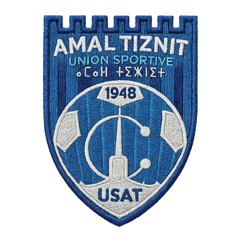

<div align="center">
  
  <h1>Ittihad al-Riyadi Amal Tiznit (USAT)</h1>
  <p><strong>Official Digital Platform & Design System</strong></p>
  <p><em>Tiznit, Souss-Massa, Morocco 🇲🇦</em></p>

  <p>
    <a href="#-overview">Overview</a> •
    <a href="#-tech-stack">Tech Stack</a> •
    <a href="#-getting-started">Getting Started</a> •
    <a href="#-project-structure">Project Structure</a> •
    <a href="#-design-system">Design System</a> •
    <a href="#-admin-panel">Admin Panel</a>
  </p>

  <p>
    
    
    
    
    
    
  </p>
</div>

---

## ⚽ Overview

Welcome to the official digital platform of **Ittihad al-Riyadi Amal Tiznit (USAT)**, a premier Moroccan football club based in the historic silver city of Tiznit, Souss-Massa.

This platform provides fans, media, and supporters with a modern digital home featuring:
- **Real-time Match Center**: Upcoming fixtures, live scores, and stadium ticketing.
- **First Team Squad Showcase**: Player profiles, squad numbers, and season statistics.
- **Official News Feed**: Category-filtered club articles and press announcements.
- **Partners & Sponsors Marquee**: Infinite smooth-scrolling brand showcase for club sponsors.
- **Official Club Shop**: Merchandise, official 2026 home/away kits, and training gear.
- **Interactive Design System**: Bespoke visual token architecture located at `/design-system`.

---

## 🎨 Design System

The visual design is built upon a **60-25-10-5 proportional color system** inspired by modern European professional football platforms and authentic Tiznit heritage:

- **60% Neutral Background**: `#040914` (Deep Athletic Dark Obsidian)
- **25% Dark Surfaces**: `#0E182A` (Slate Surface) & `#16243D` (Card Surface)
- **10% Primary Club Color**: `#002D62` (Deep Athletic Royal Blue)
- **5% Accent Colors**: `#D4AF37` (Tiznit Amber Gold) & `#9E1B1B` (Moroccan Atlas Crimson)

### Typography Scale
- **Display / Editorial Font**: `Oswald`, `Noto Sans Arabic`, `Tajawal`
- **Body Font**: `Inter`

---

## 🛠️ Tech Stack

### Frontend
- **Framework**: React 19 + TypeScript
- **Build Tool**: Vite
- **Routing**: React Router v7 (`BrowserRouter`)
- **Styling**: Tailwind CSS + Custom CSS Design Tokens
- **Icons**: Lucide Icons

### Backend
- **Runtime**: Node.js + Express.js
- **Database**: MySQL 5.7 / 8.x
- **Driver**: `mysql2/promise`
- **Authentication**: JWT (JSON Web Tokens) + `bcryptjs`

---

## 📂 Project Structure

```
amal-tiznit-official-website/
├── amal-db/                  # Isolated MySQL database layer
│   ├── db.js                 # Central MySQL connection pool
│   ├── init.js               # Database schema creation & seeding
│   ├── migrate.js            # Migration runner
│   └── README.md             # Database documentation
├── backend/                  # Express REST API Server
│   ├── config/               # DB configuration
│   ├── controllers/          # API route controllers
│   ├── routes/               # API endpoints (/players, /matches, /news, /orders, /tickets)
│   ├── server.js             # Express entry point
│   └── .env.example          # Environment variable template
└── frontend/                 # React Single Page Application
    ├── Assets/               # Official logos, sponsor graphics & media
    ├── components/           # Reusable UI components & Layouts
    │   └── ui/               # USAT Design System components
    ├── pages/                # Public pages & Admin management screens
    ├── App.tsx               # App routing configuration
    ├── index.css             # CSS Design Tokens & custom keyframes
    └── vite.config.ts        # Vite configuration
```

---

## 🚀 Getting Started

### Prerequisites
- **Node.js** (v18.0.0 or higher)
- **npm** (v9.0.0 or higher)
- **MySQL** (v5.7 / 8.x or via XAMPP/WampServer)

---

### 1. Database Initialization

Ensure your local MySQL server is running on `localhost:3306`, then run:

```bash
cd amal-db
npm install
node init.js
```

This will automatically create the `amal_tiznit_db` database, table schemas, and seed initial demo data.

---

### 2. Backend Setup

```bash
cd ../backend
npm install
cp .env.example .env
npm run dev
```

The Express server will start at `http://localhost:5000`.

---

### 3. Frontend Setup

```bash
cd ../frontend
npm install
npm run dev
```

Open your browser at `http://localhost:5173`.

---

## 🔑 Default Admin Credentials

Created automatically by `amal-db/init.js` on first run:

| Field | Value |
|---|---|
| **Login URL** | `/admin/login` |
| **Email** | `admin@amaltiznit.com` |
| **Password** | `admin123` |

---

## 🔗 Key Routes

- `/` – Official Homepage
- `/players` – First Team Squad
- `/matches` – Match Center & Fixtures
- `/news` – Official News Archive
- `/tickets` – Match Ticketing
- `/shop` – Official Club Merchandise
- `/design-system` – Interactive Visual Design System Showcase
- `/admin` – Protected Administration Dashboard

---

## 📜 License

© 2026 **Ittihad al-Riyadi Amal Tiznit (USAT)**. All rights reserved.
